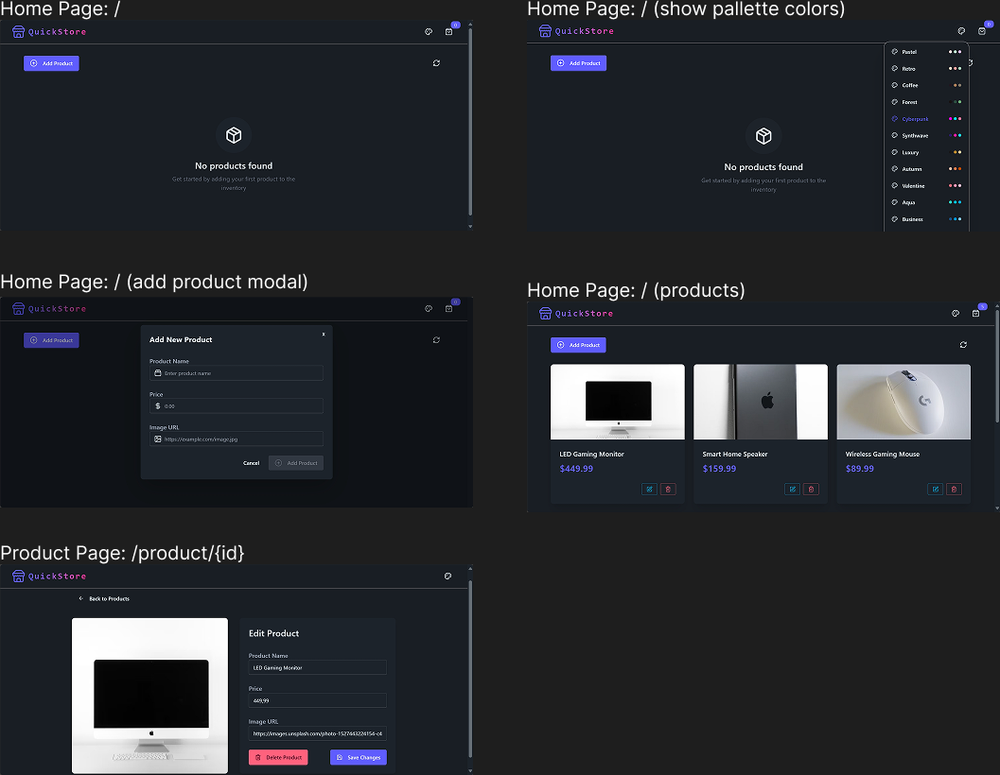

# Quick Store

## Overview

**Quick Store** is a web application used for storing products with full CRUD operations, built with modern technologies for performance and scalability.

## Features

### ✅ Current Features:
- Create, Read, Update, Delete (CRUD) operations for products
- API rate limiting for backend security
- Bot detection and prevention with Arcjet

## Installation

To get started with the **Quick Store Web**, follow these steps:

1. **Clone the repository:**

    ```bash
    git clone https://github.com/muhammadderic/quick-store-web-app.git
    cd quick-store-web-app
    ```

2. **Install dependencies:**

    ```bash
    npm install
    ```

3. **Run the development server:**

    ```bash
    npm run dev
    ```

    Run [http://localhost:5000](http://localhost:5000) to start server, then visit [http://localhost:3000](http://localhost:3000) to see the pages.

## Screenshots

<div style="display: flex; justify-content: space-between;">
    
</div>

*Screenshot description*

## Technologies Used

- **PERN Stack** – PostgreSQL, Express.js, React.js, and Node.js for full-stack web development
- **Neon Database** – Serverless PostgreSQL database optimized for scalability and low-latency connections
- **Arcjet** – Security middleware for bot detection and API protection

## Contributing

Contributions are welcome! If you'd like to contribute to this project, please follow these steps:

1. Fork the repository.
2. Create a new branch for your feature or bugfix.
3. Commit your changes and push your branch.
4. Open a pull request to have your changes reviewed.

## License

This project is licensed under the MIT License. See the [LICENSE](LICENSE) file for more details.

## Contact

If you have any questions or suggestions, feel free to reach out:

- **GitHub**: [muhammadderic](https://github.com/muhammadderic)
