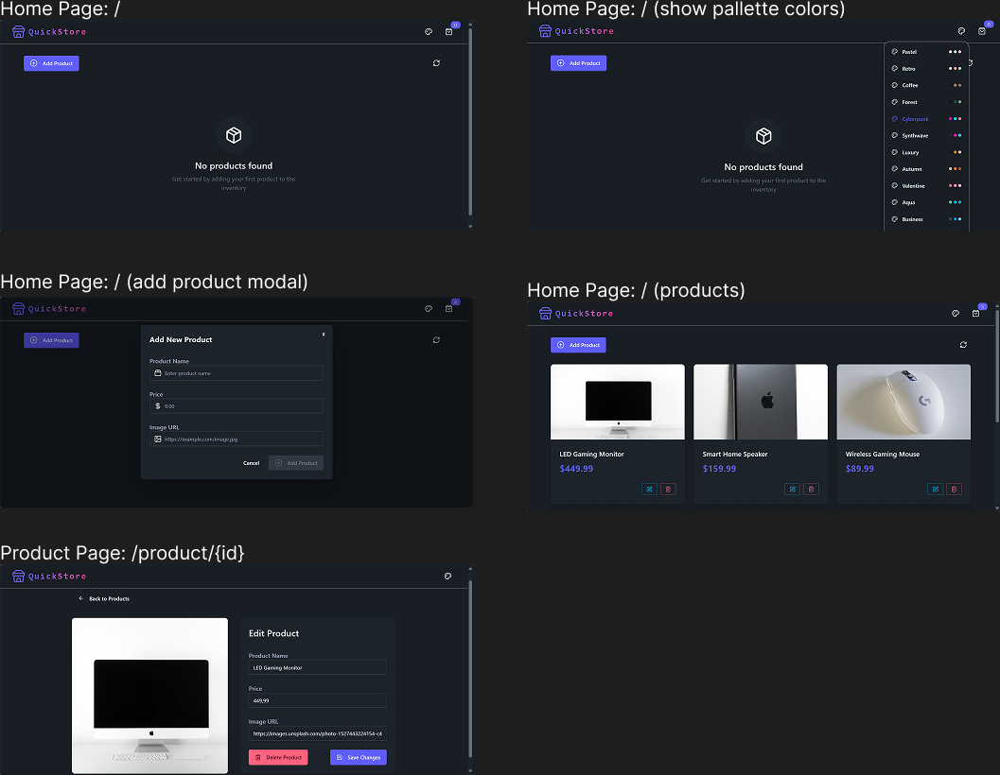

# Quick Store

## Overview

**Quick Store** is a web application used for storing products with full CRUD (Create, Read, Update, Delete) operations. It also includes basic protection features such as rate limiting and bot detection to ensure safe and controlled usage.

## Features

### ✅ Current Features:
- Create, Read, Update, and Delete (CRUD) products
- Rate limiting to prevent API abuse
- Bot detection to secure endpoints from automated attacks

## Installation

To get started with the **Quick Store Web**, follow these steps:

1. **Clone the repository:**

    ```bash
    git clone https://github.com/muhammadderic/quick-store-web-app.git
    cd quick-store-web-app
    ```

2. **Install dependencies:**

    ```bash
    npm install
    ```

3. **Run the development server:**

    ```bash
    npm run dev
    ```

    Run [http://localhost:5000](http://localhost:5000) to start server, then visit [http://localhost:3000](http://localhost:3000) to see the pages.

## Screenshots

<div style="display: flex; justify-content: space-between;">
    
</div>

## Technologies Used

- **PERN Stack** – PostgreSQL, Express.js, React, and Node.js for full-stack development
- **Neon Database** – Serverless PostgreSQL backend with separation of compute and storage
- **Arcjet** – Modern security layer for rate limiting, bot detection, and web protection

## Contributing

Contributions are welcome! If you'd like to contribute to this project, please follow these steps:

1. Fork the repository.
2. Create a new branch for your feature or bugfix.
3. Commit your changes and push your branch.
4. Open a pull request to have your changes reviewed.

## License

This project is licensed under the MIT License. See the [LICENSE](LICENSE) file for more details.

## Contact

If you have any questions or suggestions, feel free to reach out:

- **GitHub**: [muhammadderic](https://github.com/muhammadderic)
